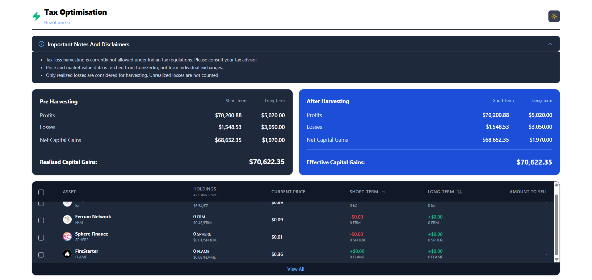

<div align="center">

# 🚀 Tax Loss Harvesting Tool

### 💰 Optimize Your Crypto Taxes Smartly & Efficiently

An interactive and responsive crypto tax dashboard that helps users identify unrealized losses, simulate harvesting strategies, and visualize effective capital gains in real time.

<br/>

### 🌐 Live Demo
🔗 **[View Deployed Project](https://tax-loss-harvesting-tool-fawn.vercel.app/)**

<br/>

[](https://reactjs.org/)
[](https://vitejs.dev/)
[](https://tailwindcss.com/)
[](https://developer.mozilla.org/en-US/docs/Web/JavaScript)

</div>

---

# 📖 Overview

The **Tax Loss Harvesting Tool** is a modern financial dashboard built to help crypto investors reduce taxable gains by identifying assets with unrealized losses.

Users can dynamically select assets for harvesting and instantly visualize:

- 📈 Capital Gains Before Harvesting
- 📉 Effective Gains After Harvesting
- 💵 Estimated Tax Savings
- ⚡ Real-time portfolio adjustments

The project focuses heavily on **clean UI/UX**, **responsive design**, and **modular frontend architecture**.

---

# ✨ Features

## 📊 Smart Tax Harvesting Engine
- Real-time tax harvesting calculations
- Dynamic STCG & LTCG adjustments
- Instant profit/loss updates

## 🧾 Interactive Holdings Table
- Sortable holdings data
- Smooth animations using `@formkit/auto-animate`
- Responsive internal table scrolling

## 🌙 Professional User Experience
- Dark / Light theme support
- Hover tooltips for detailed prices
- Guided "How It Works" section
- Clean financial dashboard aesthetics

## ⚡ Async Mock API Integration
- Simulated backend API using async Promise-based architecture
- Realistic production-style data handling

## 📱 Fully Responsive Design
- Optimized for:
  - Desktop 💻
  - Tablet 📱
  - Mobile 📲

---

# 🛠️ Tech Stack

| Technology | Usage |
|------------|-------|
| React.js | Frontend UI |
| Vite | Fast Build Tool |
| Tailwind CSS | Styling & Responsive Design |
| JavaScript | Application Logic |
| AutoAnimate | Smooth UI Animations |

---

# 📂 Project Structure

```text
src/
├── components/
│   ├── HoldingsTable.jsx
│   ├── PreHarvestingCard.jsx
│   └── PostHarvestingCard.jsx
│
├── hooks/
│   ├── useDarkMode.js
│   └── useTaxHarvesting.js
│
├── utils/
│   ├── api.js
│   ├── calculations.js
│   └── data.js
│
├── App.jsx
├── main.jsx
└── index.css
```

---

# 📸 Project Screenshots

<div align="center">

## 💻 Main Dashboard


<br/>
<br/>

## 🌙 Dark Mode Dashboard



</div>

---

---

# 🚀 Getting Started

## 1️⃣ Clone Repository

```bash
git clone https://github.com/pravin-rathod-git/Tax-Loss-Harvesting-Tool.git
```

## 2️⃣ Navigate to Project

```bash
cd Tax-Loss-Harvesting-Tool
```

## 3️⃣ Install Dependencies

```bash
npm install
```

## 4️⃣ Start Development Server

```bash
npm run dev
```

---

# 🌐 Deployment

The project is deployed on **Vercel**.

🔗 **Live Project:**  
https://tax-loss-harvesting-tool-fawn.vercel.app/

---

# 🎯 Future Improvements

- 🔐 Authentication & User Portfolios
- 📡 Real Crypto API Integration
- 📊 Advanced Analytics & Charts
- ☁️ Backend Database Integration
- 📑 Export Tax Reports (PDF/CSV)

---

# 👨‍💻 Author

### Pravin Rathod

- GitHub: https://github.com/pravin-rathod-git
- LinkedIn: Add your LinkedIn here

---

<div align="center">

### ⭐ If you liked this project, consider giving it a star on GitHub!

</div>
